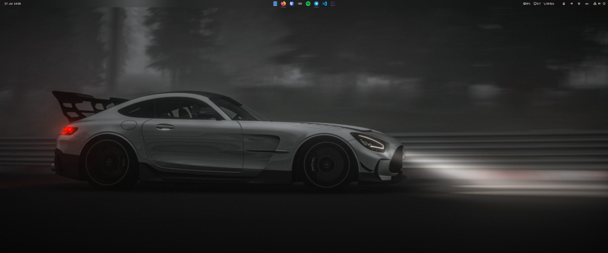

# My NixOS Configuration



## What This Is

This is my personal NixOS setup using flakes and home-manager. It's configured for GNOME with gaming support, nice theming via Stylix, and includes the tools I actually use day-to-day.

Feel free to steal anything useful from it!

## 💻 My Setup

| Component | Specs |
|-----------|-------|
| **CPU** | Intel i5-13600KF (13th gen) |
| **RAM** | 64GB |
| **GPU** | NVIDIA GeForce RTX 4060 (gaming/main) |
| **GPU** | AMD Radeon Pro WX 5100 (VM passthrough for work) |
| **Storage** | 465GB NVMe SSD (main) + 465GB SSD (extra) |

## 📁 Project Structure

```
nix-config/
├── flake.nix              # Main flake configuration
├── flake.lock             # Locked dependency versions
├── CLAUDE.md              # AI assistant instructions
├── nixos/                 # System-wide NixOS configuration
│   ├── default.nix        # Main system configuration
│   ├── hardware.nix       # Hardware-specific settings
│   ├── user.nix           # User account management
│   ├── gnome.nix          # GNOME desktop environment
│   ├── nvidia.nix         # NVIDIA graphics configuration
│   ├── gaming.nix         # Gaming optimizations
│   ├── audio.nix          # Audio/PipeWire setup
│   ├── virtualization.nix # VM and container support
│   └── [other modules]    # Specialized configurations
├── home-manager/          # User environment configuration
│   ├── default.nix        # Main home configuration
│   ├── config/            # Additional user configs
│   ├── wallpapers/        # System wallpapers
│   └── zen.nix            # Zen browser setup
├── pkgs/                  # Custom package definitions
│   └── citron-emu/        # Custom emulator package
└── overlays/              # Package modifications
    └── default.nix        # Package overlays
```

## 🚀 Quick Start

### Prerequisites
- NixOS installed with flakes enabled
- Git for version control

### Installation

1. **Clone the repository**
   ```bash
   git clone https://github.com/yourusername/nix-config.git
   cd nix-config
   ```

2. **Update hardware configuration**
   ```bash
   # Generate your hardware config
   sudo nixos-generate-config --show-hardware-config > nixos/hardware.nix
   ```

3. **Customize user settings**
   ```bash
   # Edit flake.nix to change username if needed
   nano flake.nix
   ```

4. **Apply the configuration**
   ```bash
   # Add files to git (required for flakes)
   git add .
   
   # Build and switch to new configuration
   sudo nixos-rebuild switch --flake .
   
   # Apply home-manager configuration
   home-manager switch --flake .
   ```

## 💻 Usage

### System Management
```bash
# Update system configuration
sudo nixos-rebuild switch --flake .

# Test configuration without switching
sudo nixos-rebuild test --flake .

# Update flake inputs to latest versions
nix flake update
```

### Home Environment
```bash
# Update user environment
home-manager switch --flake .

# Build without switching
home-manager build --flake .
```

### Package Management
```bash
# Build custom packages
nix build .#citron-emu

# Enter development shell with package
nix shell .#package-name

# Show flake information
nix flake show
```

## 🎛️ Configuration Details

### System Features
- **Desktop Environment**: GNOME with custom theming
- **Graphics**: NVIDIA drivers with gaming optimizations
- **Audio**: PipeWire with low-latency configuration
- **Virtualization**: QEMU/KVM and Docker support
- **Gaming**: Steam, Lutris, and performance tweaks

### User Environment
- **Shell**: Zsh with custom configuration
- **Browser**: Zen browser with optimizations
- **Theming**: Stylix for consistent application themes
- **Wallpapers**: Custom curated collection

### Security & Privacy
- **GPG**: Configured for secure communications
- **SSH**: Optimized client configuration
- **Firewall**: Enabled with sensible defaults

## 🔧 Customization

### Adding New Packages
1. Add packages to the appropriate configuration file
2. For custom packages, create a derivation in `pkgs/`
3. Update `overlays/default.nix` if needed

### Theming Changes
- Modify theme settings in the Stylix configuration
- Update wallpapers in `home-manager/wallpapers/`
- Customize GNOME settings in `nixos/gnome.nix`

### Hardware Adjustments
- Update `nixos/hardware.nix` for your specific hardware
- Modify driver configurations in respective module files

## 🆘 Troubleshooting

### Common Issues

**Files not found by Nix**
```bash
# Ensure all files are tracked by git
git add .
```

**Outdated packages**
```bash
# Update flake inputs
nix flake update
```

**Build failures**
```bash
# Check for syntax errors
nix flake check
```

### Getting Help
- Check the [NixOS Manual](https://nixos.org/manual/nixos/stable/)
- Visit the [NixOS Wiki](https://nixos.wiki/)
- Join the [NixOS Community](https://nixos.org/community/)

## 📜 License

This configuration is provided as-is for educational and personal use. Feel free to adapt it to your needs.

## 🙏 Acknowledgments

- [NixOS Community](https://nixos.org/community/) for the amazing ecosystem
- [Home Manager](https://github.com/nix-community/home-manager) for user environment management
- [Stylix](https://github.com/danth/stylix) for beautiful system theming
- Various package maintainers and contributors

---

<div align="center">

**Built with ❤️ using NixOS**

*Reproducible • Declarative • Reliable*

</div>