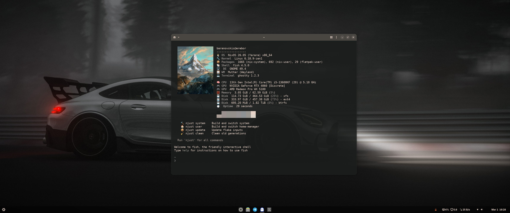

# My NixOS Configuration

[](https://github.com/baranovskis/nix-config/actions/workflows/check.yml)



A personal NixOS flake with GNOME, Stylix theming, gaming, VFIO passthrough, and a modern CLI toolchain. Inspired by [Bluefin OS](https://projectbluefin.io/) and its opinionated, batteries-included desktop philosophy.

Steal anything useful!

## What's Inside

### System (`modules/`)
- **GNOME** on Wayland with Stylix auto-theming
- **PipeWire** audio, Bluetooth, CUPS printing
- **NVIDIA** proprietary drivers (open kernel modules)
- **VFIO** GPU passthrough with Looking Glass (`kvmfr`)
- **Steam** + Proton-GE, GameMode, MangoHud
- **Ollama** with CUDA acceleration for local LLMs
- **Docker**, libvirt/QEMU/KVM, Sunshine streaming
- **ZFS** with auto-scrub, snapshots, and restic backups
- **Flatpak** (declarative) — Telegram, Bitwarden, Spotify, GIMP, Inkscape, Lutris, Heroic, Bottles, Zed, JetBrains Toolbox
- **Zen Browser** (declarative wrapFirefox)
- Firmware updates via fwupd, NuPhy keyboard support, Solaar for Logitech

### User (`home-manager/`)
- **Ghostty** terminal with Fish integration
- **Fish** shell + **Starship** prompt + **Atuin** history
- **Yazi** file manager, **Nautilus** with custom bookmarks (GNOME-specific)
- **MangoHud** FPS overlay for gaming
- **bat**, **eza**, **btop**, **fastfetch**, **fzf**, **zoxide**, **fd**, **ripgrep**, **dust**, **duf**, **procs**, **sd**, **tealdeer**
- **direnv** with nix-direnv, Node.js 22, Python 3, Claude Code
- **Stylix** dark theme — Inter font, JetBrains Mono, Papirus icons, Capitaine cursors

## Project Structure

```
nix-config/
├── flake.nix                 # Flake definition and inputs
├── Justfile                  # Command shortcuts
├── lib/
│   └── default.nix           # mkHost + mkHome helpers
├── hosts/
│   └── erebor/               # Desktop workstation
│       ├── default.nix       # Enables profiles/modules, NVIDIA, VFIO, boot, restic
│       └── hardware.nix      # Generated hardware config
├── modules/                  # NixOS system modules
│   ├── default.nix           # Imports core + wm + profiles + all modules
│   ├── core/                 # Always-on base system
│   │   ├── nix.nix           # Nix daemon, flakes
│   │   ├── locale.nix        # Timezone, i18n
│   │   ├── networking.nix    # NetworkManager
│   │   ├── shell.nix         # Fish shell
│   │   ├── user.nix          # User accounts
│   │   ├── gc.nix            # Garbage collection
│   │   ├── packages.nix      # Base system packages
│   │   ├── ssh.nix           # SSH
│   │   └── power.nix         # Power management
│   ├── wm/                   # Window managers (swappable)
│   │   └── gnome.nix         # modules.wm.gnome.enable
│   ├── profiles/
│   │   └── desktop/          # profiles.desktop.enable
│   │       ├── audio.nix     # PipeWire
│   │       ├── bluetooth.nix # Bluetooth
│   │       ├── flatpak.nix   # Flatpak + Flathub packages
│   │       ├── gnupg.nix     # GnuPG
│   │       ├── nuphy.nix     # NuPhy keyboard
│   │       ├── printing.nix  # CUPS
│   │       ├── solaar.nix    # Logitech Solaar
│   │       └── zen-browser.nix # Zen Browser
│   ├── gpu.nix               # modules.gpu.enable
│   ├── gaming.nix            # modules.gaming.enable
│   ├── zfs.nix               # modules.zfs.enable
│   ├── docker.nix            # modules.docker.enable
│   ├── virtualization.nix    # modules.virtualization.enable
│   ├── ai.nix                # modules.ai.enable
│   ├── sunshine.nix          # modules.sunshine.enable
│   ├── rdp.nix               # modules.rdp.enable
│   └── nfs.nix               # modules.nfs.enable
├── home-manager/             # User environment
│   ├── default.nix           # Entry point (WM-agnostic)
│   ├── config/
│   │   └── stylix.nix        # Theme, fonts, icons, cursor
│   ├── wm/                   # WM-specific user config
│   │   └── gnome/
│   │       ├── default.nix   # Nautilus bookmarks
│   │       └── dconf.nix     # GNOME dconf settings
│   ├── hosts/
│   │   └── erebor.nix        # Host-specific (Looking Glass, imports wm/gnome)
│   ├── modules/
│   │   └── nautilus.nix      # Nautilus bookmarks module
│   ├── programs/
│   │   ├── fish.nix          # Fish shell
│   │   ├── starship.nix      # Starship prompt
│   │   ├── ghostty.nix       # Ghostty terminal
│   │   ├── gaming.nix        # MangoHud
│   │   ├── atuin.nix         # Shell history
│   │   ├── bat.nix           # bat
│   │   ├── btop.nix          # System monitor
│   │   ├── eza.nix           # ls replacement
│   │   ├── fastfetch.nix     # System info
│   │   ├── fzf.nix           # Fuzzy finder
│   │   ├── yazi.nix          # File manager
│   │   ├── zoxide.nix        # Smart cd
│   │   ├── direnv.nix        # direnv + nix-direnv
│   │   ├── git.nix           # Git
│   │   └── packages.nix      # User packages
│   └── wallpapers/
├── pkgs/                     # Custom packages
└── overlays/
    └── default.nix           # Package overlays
```

## Adding a New Host

```nix
# 1. Create hosts/moria/default.nix + hardware.nix
{ ... }: {
  imports = [ ./hardware.nix ];
  networking.hostName = "moria";
  modules.docker.enable = true;
  # No profiles.desktop — headless server
}

# 2. Add one line to flake.nix
nixosConfigurations.moria = lib.mkHost { hostname = "moria"; };
```

## Adding a New Window Manager

```nix
# System side:
# 1. Create modules/wm/hyprland.nix with modules.wm.hyprland.enable
# 2. Import it in modules/wm/default.nix

# User side:
# 3. Create home-manager/wm/hyprland/ with WM-specific user config
# 4. Import from home-manager/hosts/<hostname>.nix

# In a host:
# modules.wm.hyprland.enable = true;
```

## Usage

Everything is managed through `njust` (works from any directory):

```bash
njust system      # Build and switch NixOS config
njust user        # Build and switch home-manager config
njust update      # Update all flake inputs
njust clean       # GC old generations + prune Docker + Flatpak
njust changelogs  # Diff between current and previous generation
njust backup      # Run restic backup now
njust backup-list # List backup snapshots
njust bios        # Reboot into UEFI firmware setup
njust             # Show all available commands
```

`njust` is a Fish shell alias defined in `home-manager/programs/fish.nix` that runs `just` with the correct Justfile and working directory. You can also use `just` directly when inside the `~/nix-config` directory.

Or manually:

```bash
sudo nixos-rebuild switch --flake .#$(hostname)
home-manager switch --flake .
```

All files must be `git add`ed before Nix can see them.

## Acknowledgments

- [Bluefin OS](https://projectbluefin.io/) for the inspiration
- [NixOS](https://nixos.org/) and [Home Manager](https://github.com/nix-community/home-manager)
- [Stylix](https://github.com/danth/stylix) for system-wide theming
- Erebor logo by [Aronja Art](https://www.artstation.com/artwork/5Xq5J)
