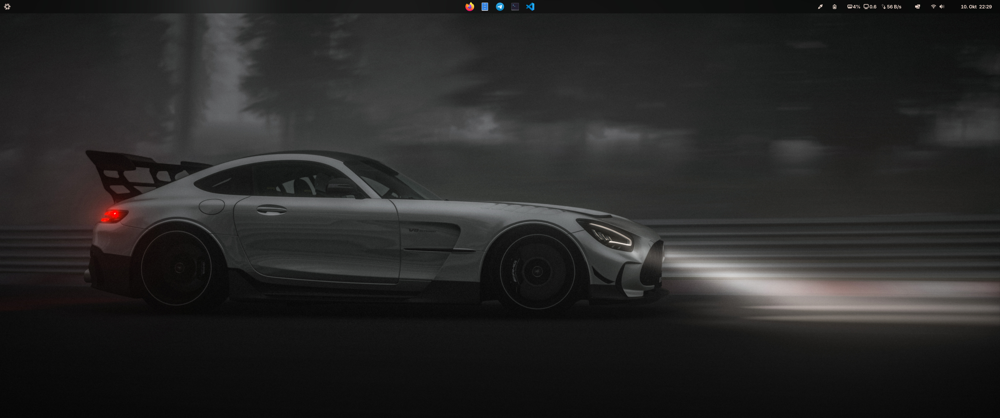

# My NixOS Configuration



## What This Is

This is my personal NixOS setup using flakes and home-manager. It's configured for GNOME with gaming support, nice theming via Stylix, and includes the tools I actually use day-to-day.

Feel free to steal anything useful from it!

## 💻 My Setup

| Component | Specs |
|-----------|-------|
| **CPU** | Intel i5-13600KF (13th gen) |
| **RAM** | 64GB |
| **GPU** | NVIDIA GeForce RTX 4060 (gaming/main) |
| **GPU** | AMD Radeon Pro WX 5100 (VM passthrough for work) |

## 📁 Project Structure

```
nix-config/
├── flake.nix              # Main flake configuration
├── flake.lock             # Locked dependency versions
├── CLAUDE.md              # AI assistant instructions
├── hosts/                 # Host-specific configurations
│   └── erebor/            # Desktop machine config
│       ├── default.nix    # Host settings, boot loader, kernel
│       ├── hardware.nix   # Auto-detected hardware config
│       ├── graphics.nix   # GPU configuration (OpenGL/Vulkan)
│       ├── nvidia.nix     # NVIDIA drivers & kernel params
│       ├── radeon.nix     # AMD Radeon & VFIO scripts
│       ├── vfio.nix       # GPU passthrough & Looking Glass
│       └── gaming.nix     # Gaming (Steam, Wine, Lutris, Heroic)
├── common/                # Shared system configuration
│   ├── default.nix        # System config entry point
│   ├── audio.nix          # Audio/PipeWire
│   ├── bluetooth.nix      # Bluetooth
│   ├── docker.nix         # Docker containerization
│   ├── gc.nix             # Garbage collection
│   ├── gnome.nix          # GNOME desktop
│   ├── gnupg.nix          # GnuPG
│   ├── locale.nix         # Timezone & i18n
│   ├── networking.nix     # Network configuration
│   ├── nfs.nix            # NFS server/client
│   ├── nix.nix            # Nix daemon settings
│   ├── nuphy.nix          # NuPhy keyboard
│   ├── packages.nix       # System packages (includes just)
│   ├── power.nix          # Power management
│   ├── printing.nix       # CUPS printing
│   ├── rdp.nix            # Remote desktop (GNOME RDP)
│   ├── shell.nix          # Fish shell
│   ├── solaar.nix         # Logitech devices
│   ├── ssh.nix            # SSH configuration
│   ├── user.nix           # User accounts
│   └── virtualization.nix # QEMU/KVM/libvirt
├── home-manager/          # User environment configuration
│   ├── default.nix        # Home-manager entry point
│   ├── config/            # Desktop configs
│   │   ├── default.nix    # Config imports
│   │   └── dconf.nix      # GNOME dconf settings
│   ├── programs/          # User applications (shared)
│   │   ├── default.nix    # Program imports
│   │   ├── direnv.nix     # direnv integration
│   │   ├── looking-glass.nix # Looking Glass client
│   │   └── packages.nix   # User packages
│   ├── themes/            # Theming
│   │   └── stylix.nix     # Stylix configuration
│   └── wallpapers/        # System wallpapers
├── pkgs/                  # Custom package definitions
│   └── citron-emu/        # Custom emulator package
├── overlays/              # Package modifications
│   └── default.nix        # Package overlays
└── Justfile               # Command shortcuts (just system, just user, just clean)
```

## 🚀 Quick Start

### Prerequisites
- NixOS installed with flakes enabled
- Git for version control

### Installation

1. **Clone the repository**
   ```bash
   git clone https://github.com/yourusername/nix-config.git
   cd nix-config
   ```

2. **Create your host configuration**
   ```bash
   # Generate your hardware config
   sudo nixos-generate-config --show-hardware-config > hosts/yourhostname/hardware.nix

   # Create host-specific config
   mkdir -p hosts/yourhostname
   cp hosts/erebor/default.nix hosts/yourhostname/default.nix
   # Edit and customize as needed
   ```

3. **Customize user settings**
   ```bash
   # Edit flake.nix to change username if needed
   nano flake.nix
   ```

4. **Apply the configuration**
   ```bash
   # Add files to git (required for flakes)
   git add .

   # Build and switch to new configuration (replace 'erebor' with your hostname)
   sudo nixos-rebuild switch --flake .#erebor

   # Apply home-manager configuration
   home-manager switch --flake .
   ```

## 💻 Usage

This configuration uses `just` for simplified command management. Run `just` to see all available commands.

### Quick Commands
```bash
# Build and switch system configuration
just system

# Build and switch home-manager configuration
just user

# Update flake inputs to latest versions
just update

# Clean old generations (system + home, keeps last 7 days)
just clean
```

That's it! Keep it simple.

### Manual Commands (if you prefer)
```bash
# System
sudo nixos-rebuild switch --flake .#erebor

# Home-manager
home-manager switch --flake .

# Flake updates
nix flake update

# Check for errors
nix flake check
```

## 🎛️ Configuration Details

### System Features
- **Kernel**: Zen kernel (linuxPackages_zen) for gaming optimization
- **Boot Loader**: systemd-boot with 10 generation limit
- **Desktop Environment**: GNOME with custom theming
- **Graphics**: Dual GPU setup (NVIDIA RTX 4060 proprietary + AMD Radeon WX 5100)
- **Audio**: PipeWire with low-latency configuration
- **Virtualization**: QEMU/KVM with VFIO GPU passthrough and Looking Glass
- **Gaming**: Steam with Proton-GE, GameMode, Wine staging, Lutris, Heroic, Bottles
- **Containerization**: Docker support
- **Command Runner**: Just for simplified workflow

### User Environment
- **Shell**: Fish with custom configuration
- **Browser**: Zen browser with MIME associations
- **Development**: direnv with nix-direnv, VSCode, Node.js 22
- **Productivity**: GIMP, Inkscape, Bitwarden, Firefox
- **Media**: Spotify, Telegram, ffmpeg
- **Theming**: Stylix for consistent application themes
- **Fonts**: Inter (sans/serif), JetBrains Mono (monospace)

### Security & Privacy
- **GPG**: Configured for secure communications
- **SSH**: Optimized client configuration
- **Firewall**: Enabled with sensible defaults

## 🆘 Troubleshooting

### Common Issues

**Files not found by Nix**
```bash
# Ensure all files are tracked by git
git add .
```

**Outdated packages**
```bash
# Update flake inputs
nix flake update
```

**Build failures**
```bash
# Check for syntax errors
nix flake check
```

### Getting Help
- Check the [NixOS Manual](https://nixos.org/manual/nixos/stable/)
- Visit the [NixOS Wiki](https://nixos.wiki/)
- Join the [NixOS Community](https://nixos.org/community/)

## 📜 License

This configuration is provided as-is for educational and personal use. Feel free to adapt it to your needs.

## 🙏 Acknowledgments

- [NixOS Community](https://nixos.org/community/) for the amazing ecosystem
- [Home Manager](https://github.com/nix-community/home-manager) for user environment management
- [Stylix](https://github.com/danth/stylix) for beautiful system theming
- Various package maintainers and contributors

---

<div align="center">

**Built with ❤️ using NixOS**

*Reproducible • Declarative • Reliable*

</div>